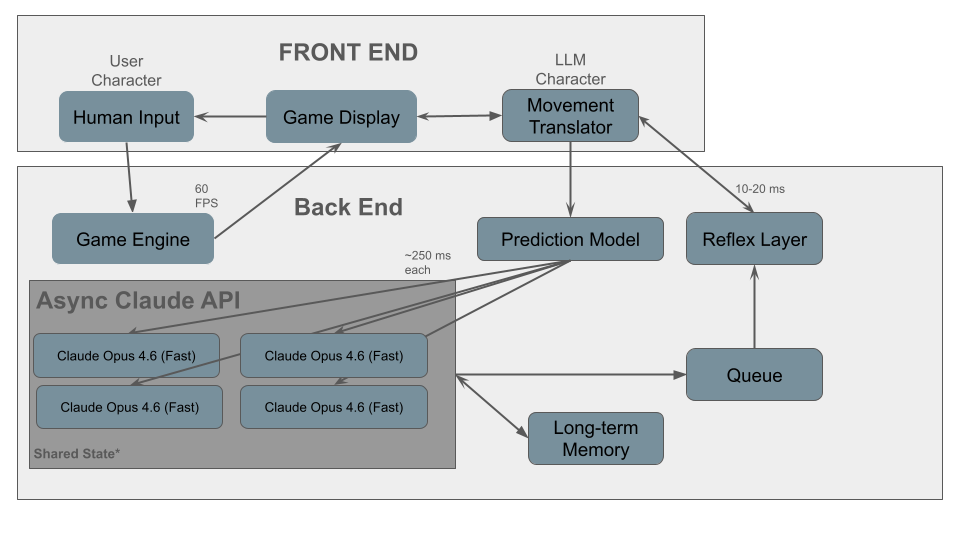

# 🏆 Neural Arena — Real-Time LLM Combat Bot (Strategy + Reflex, Zero Lag)

> A retro top-down arena shooter where you fight an AI opponent powered by an LLM — but engineered like a **real game agent**:  
> **LLM = strategy**, **Reflex Layer = frame-perfect execution**, **Prediction = latency compensation**, **Queue = stability**, **Memory = adaptation**.

---

## 🖼️ Architecture Diagram



---

## 🔍 How the System Works (End-to-End)

Neural Arena is built around one principle:

**Gameplay must never wait on inference.**  
So we split the AI into **three loops** that run at different speeds but stay synchronized with strict contracts.

### 1) Loop A — Real-Time Simulation (60 FPS)
This is the core game loop. It runs continuously and never blocks:
- Updates player + bot movement
- Simulates bullets, collisions, cooldowns, damage
- Renders the arena
- Emits an immutable **State Snapshot** every tick

**State Snapshot (example contents):**
- Player pose + velocity
- Bot pose + velocity
- Health/cooldowns
- Top-K nearby bullets/threats
- Obstacle/wall proximity signals

✅ Result: the game always feels smooth and responsive.

---

### 2) Loop B — LLM Planning Pipeline (Async, pipelined ~250ms)
LLMs are strong at **strategy**, but too slow for micro-reactions.  
So the LLM never directly drives frame-by-frame controls. It outputs a **compact intent**.

#### Step B1 — Prediction Model (Latency Compensation)
To avoid the bot “thinking behind reality,” we predict where the player will be when the command lands.

Dead-reckoning idea:
`p_future = p_now + v_now * Δt`

Where `Δt` approximates network + model latency.

We produce a **Future Snapshot** that reflects the likely state at execution time.

#### Step B2 — Async + Pipelined LLM Calls
We keep multiple LLM calls in-flight:
- While one request is processing, the next snapshot is already queued
- The bot always has a fresh decision incoming
- This eliminates the “pause… think… move” effect

#### Step B3 — Strict Output: Intent Packet
The LLM returns an **Intent Packet** — not raw actions:
- `dx, dy` movement bias (−1..1)
- `shoot` / `shoot_probability`
- optional `goal` / `aggression`
- `tick_id` (ordering + staleness protection)

#### Step B4 — Staleness Protection (Critical)
Because async calls can return out of order:
- Every request includes `tick_id`
- Every response must echo it
- Older responses are discarded automatically

✅ Result: the bot stays strategic without becoming “late.”

---

### 3) Loop C — Reflex Execution (10–20ms)
This layer runs locally and fast. It is responsible for **real-time feel**.

It reads the latest valid intent from the **Intent Queue** and:
- Converts intent into frame-by-frame controls
- Smooths movement so the bot feels continuous
- Enforces **actuation guardrails** (no wall clipping, obey cooldowns)
- Performs emergency dodging when threats are imminent

✅ Result: the bot reacts like a real player even if the LLM takes hundreds of milliseconds.

---

## 🧠 Long-Term Memory (Adaptive Opponent)
We don’t store unlimited text. We store **bounded, measurable features** that actually improve play:
- Player style classification (strafer / rusher / camper)
- Typical dodge direction
- Preferred engagement distance
- Pressure response (hit rate under threat)

These features are injected into future prompts so the AI **adapts across rounds**, not just within one.

---

## 🚀 Why This Wins (What Judges Actually Care About)

### ✅ Not a demo gimmick — a real architecture
Most “LLM bots” are:
- slow
- jittery
- random
- prompt-dependent

Neural Arena is:
- **engineered for latency**
- **stable under async**
- **measurable**
- **game-feel first**

### ✅ The key insight
> LLMs cannot do frame-perfect reactions — so we *don’t ask them to*.  
> We let the LLM plan and let a Reflex Layer execute.

---

## 🎮 Gameplay

- **You (human)**: move + shoot in real time  
- **AI opponent**:
  - Plans strategically via LLM
  - Executes tactically via Reflex Layer
  - Improves via Memory

Arena includes:
- Boundaries + obstacles
- Projectile combat
- Cooldowns / health system
- Bullet ownership rules (no self-damage)

---

## 🧩 Modules

### Front End
- **Human Input** → controls the player
- **Game Display** → renders at 60 FPS
- **Movement Translator** → converts AI intent into game control signals

### Back End
- **Game Engine** → physics + collisions + state snapshots
- **Prediction Model** → latency compensation for future-state planning
- **Async LLM API** → pipelined strategic decisions
- **Queue** → latest-wins intent stabilization
- **Reflex Layer** → fast execution + safety guardrails
- **Long-Term Memory** → adaptation features across rounds

---

## 📦 Data Contracts (LLM I/O)

### Input (State/Future Snapshot)
We keep this small and structured:
- Player + bot pose/velocity
- Threat summary (top-K bullets: position + velocity)
- Cooldowns + health
- Obstacles/walls proximity
- Memory feature vector

### Output (Intent Packet)
Compact JSON intent:
- `dx, dy` (movement bias)
- `shoot` or `shoot_probability`
- optional `aggression` or `goal`
- `tick_id`

---

## 📊 Observability (Hackathon-Grade Proof)
We track metrics because “it feels better” isn’t enough:
- average LLM latency (ms)
- in-flight request count
- stale discard rate (%)
- intent queue age (ms)
- bot hit rate / survival time
- dodge success rate

---

## 🛠️ Local Setup

> Replace these commands with your repo’s real ones (Python or Web).  
> The structure below is designed to be easy for judges to run.

### 1) Clone
```bash
git clone https://github.com/<your-org>/<your-repo>.git
cd <your-repo>